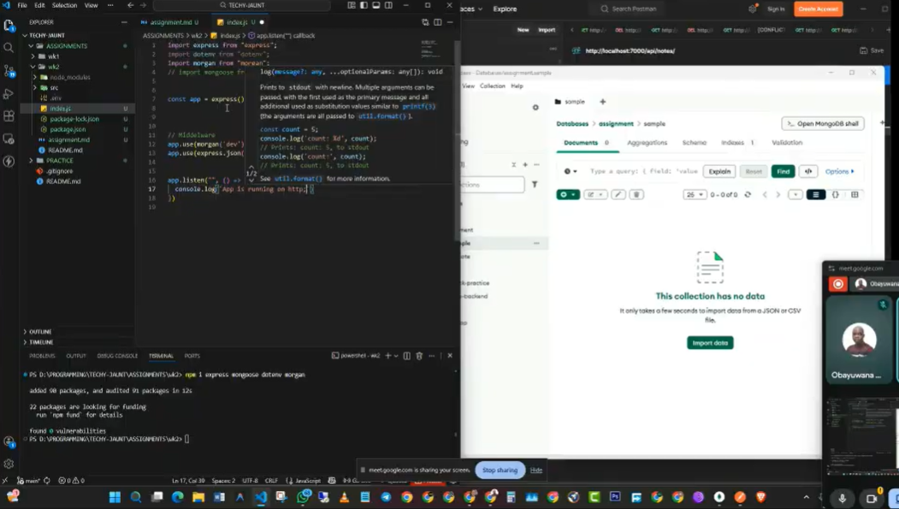

# WEEK 2 ASSIGNMENT - Contact API

A backend RESTful API built with Node.js, Express, and MongoDB. This application allows users to manage a contact list through standard CRUD operations (Create, Read, Update, Delete). It features request logging for debugging and secure environment variable management.

[](https://drive.google.com/file/d/1TYJxya_MBHsO8aLASL7t91H-436P0MbI/view?usp=sharing)

## 🛠️ Tech Stack

- **Runtime:** Node.js
- **Framework:** Express.js
- **Database:** MongoDB (via Mongoose)
- **Utilities:**
  - `dotenv` (Environment variable management)
  - `morgan` (HTTP request logger middleware)
  - `nodemon` (Development hot-reloading)

## 📂 Folder Structure & Rationale

The project follows a modular pattern to separate concerns, making the codebase easier to maintain and scale.

```text
wk2/
├── src/
│   ├── config/       # Database connection logic (DB.js)
│   ├── models/       # Mongoose schemas (ContactSchema.js)
│   └── routes/       # API route definitions (contact-routes.js)
├── .env              # Environment variables (EXCLUDED from Git)
├── .gitignore        # Files to ignore (node_modules, .env)
├── assignment.md     # The assignment details
├── index.js          # Entry point (App configuration & Middleware)
├── package.json      # Dependencies and scripts
└── README.md         # Documentation
```

## Why this structure?

src/: I moved the core logic into a source folder to keep the root directory clean.

config/: Keeping the database connection separate means index.js doesn't get cluttered with connection strings and retry logic.

models/: Defining the schema in its own file ensures that the data structure (Name, Address, Phone) is consistent across the app.

routes/: As the API grows, having all routes in index.js would become unreadable. Splitting them makes adding new features (like "Users" or "Products") much easier later.

## How to Run Locally

Follow these steps to get the application running on your machine.

1. Clone and Install
   Clone the repository and install the dependencies defined in package.json.

```bash
git clone <repository-url>
cd wk2
npm install
```

2. Environment Configuration
   Create a .env file in the root directory. This file is vital for the app to run but is hidden from GitHub for security.

Add the following variables to your .env file:

```bash
PORT=7000
MONGODB_URI=your_mongodb_connection_string_here
```

3. Start the Server
   I have configured a dev script to run the server with nodemon, which auto-restarts the server when you save changes.

```bash
npm run dev
```

Expected Output:

```bash
Server running on port 7000
Database connected successfully
```

```bash
API Endpoints
Base URL: http://localhost:7000/API/contact
```

Method, Endpoint, Description, Request Body (JSON)
GET, /, Fetch all contacts, N/A
POST, /, Create a new contact, "{ ""name"": ""John"", ""address"": ""Lagos"", ""phone"": 123456 }"
PUT, /:id, Update a contact, "Fields to update (e.g., { ""phone"": 999999 })"
DELETE, /:id, Delete a contact, N/A

## Assumptions & Debugging

While building this, I made a few architectural decisions and ran into some specific hurdles:

The "Update" Quirk: I initially noticed that when I updated a contact, the API returned the old data, even though the database updated correctly. I discovered I had to pass { new: true } to the findOneAndUpdate method to force Mongoose to return the modified document.

Phone Numbers as Numbers: I defined the phone field as a Number type in the schema. In a real-world scenario, this might be better as a String to handle country codes (+234) or leading zeros, but for this assignment, Number was chosen for simplicity.

Route Logic: Currently, the business logic (the actual saving/deleting code) lives directly inside the routes file. In a larger production app, I would move this to a dedicated controllers folder, but for a Week 2 assignment, keeping it in the routes file felt like the right balance of cleanliness and simplicity.

Morgan: I included morgan('dev') because staring at a blank terminal when requests fail is frustrating. Seeing the status codes (like 200 vs 404) in real-time helped catch typos in my URL paths immediately.
