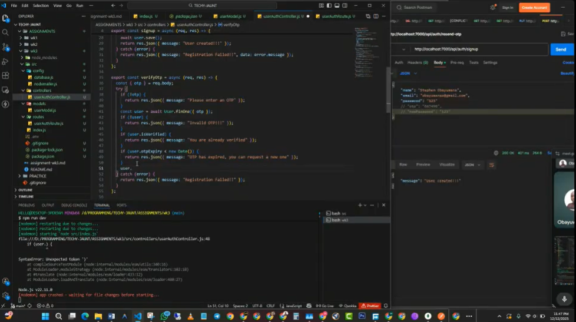

# TECHYJAUNT AUTH ASSIGNMENT - User Authentication API

A secure backend RESTful API built with Node.js and the Express framework, utilizing MongoDB for data persistence. This application provides a complete user authentication flow, including sign-up, email verification via an expiring One-Time Password (OTP), login, and password reset functionality.

The assignment's key focus was implementing the OTP expiry logic, ensuring a generated OTP has a time limit (10 minutes) before it can no longer be used for verification or password reset.

[](https://drive.google.com/file/d/1OkwecdZ2zzbu28N6YzTwCZBsknNKYWZ3/view?usp=sharing)

## 🛠️ Tech Stack

- **Runtime:** Node.js
- **Framework:** Express.js
- **Database:** MongoDB (via Mongoose)
- **Password Hashing:** bcryptjs
- **Email:** nodemailer (used to send OTP)
- **Utilities:**
  - `dotenv` (Environment variable management)
  - `morgan` (HTTP request logger middleware)
  - `nodemon` (Development hot-reloading)

## 📂 Folder Structure & Rationale

The project follows a modular pattern, organizing files by concern to improve maintainability and scalability.

```text
wk3/
├── src/
│   ├── config/       # Database and NodeMailer configuration (database.js, nodemailer.js)
│   ├── controllers/  # Business logic for all routes (userAuthController.js)
│   ├── models/       # Mongoose schemas (userModel.js)
│   └── routes/       # API route definitions (userAuthRoute.js)
│   └── index.js      # Entry point (App configuration & Middleware)
├── .env              # Environment variables (EXCLUDED from Git)
├── .gitignore        # Files to ignore (node_modules, .env)
├── package.json      # Dependencies and scripts
└── README.md         # Documentation
```

## Why this structure?

1. src/: I moved the core logic into a source folder to keep the root directory clean.

2. config/: Database connection and the email sender (NodeMailer) configuration are kept separate, preventing the main index.js file from becoming cluttered.

3. models/: Defining the schema in its own file ensures that the data structure (Name, Address, Phone) is consistent across the app.

4. routes/: As the API grows, having all routes in index.js would become unreadable. Splitting them makes adding new features (like "Users" or "Products") much easier later.

5. controllers/: The core business logic for each endpoint (sign-up, login, verification) is isolated here. This adheres to the MVC (Model-View-Controller) principle, separating the logic from the route definitions.

6. OTP and Expiry: Fields for OTP and OTPExpiry are defined in the userModel.js schema to persist the verification code and its expiration time in the database.

## 🔑 Key Features Implemented

- Secure Sign-Up: Registers a user with a hashed password using bcrypt.js.
- Email Verification: Automatically generates a 6-digit OTP upon sign-up, setting an expiration time of 10 minutes.
- OTP Validation: Checks if the provided OTP matches the stored OTP and also verifies that the OTPExpiry time has not passed.
- Password Reset: Includes logic to request a new OTP and set a new password.

## How to Run Locally

Follow these steps to get the application running on your machine.

1. Clone and Install
   Clone the repository and install the dependencies defined in package.json.

```bash
git clone <repository-url>
cd wk3
npm install
```

2. Environment Configuration
   Create a .env file in the root directory. This file is vital for the app to run but is hidden from GitHub for security.

Add the following variables to your .env file:

```bash
PORT=7000
MONGODB_URI=your_mongodb_connection_string_here
```

3. Start the Server
   I have configured a dev script to run the server with nodemon, which auto-restarts the server when you save changes.

```bash
npm run dev
```

Expected Output:

```bash
Server running on port 7000
Database connected successfully
```

```bash
API Endpoints
Base URL: http://localhost:7000/api/auth
```

| Method   | Endpoint           | Description                                                             | Request Body (JSON)                                      |
| :------- | :----------------- | :---------------------------------------------------------------------- | :------------------------------------------------------- |
| **POST** | `/signup`          | Creates a new user, hashes the password, and generates an expiring OTP. | `{ "name": "...", "email": "...", "password": "..." }`   |
| **PUT**  | `/verify-otp`      | Verifies a user's account using the generated OTP.                      | `{ "OTP": "..." }`                                       |
| **POST** | `/resend-otp`      | Requests a new OTP if the original has expired or been lost.            | `{ "email": "..." }`                                     |
| **POST** | `/login`           | Authenticates the user if verified and password is correct.             | `{ "email": "...", "password": "..." }`                  |
| **POST** | `/forget-password` | Initiates the password reset process by sending an OTP.                 | `{ "email": "..." }`                                     |
| **PUT**  | `/reset-password`  | Resets the user's password after OTP verification.                      | `{ "email": "...", "OTP": "...", "newPassword": "..." }` |

## Assumptions & Debugging

While building this, I made a few architectural decisions and ran into some specific hurdles:

1. OTP Expiration Logic: The requirement to implement OTP expiry was met by calculating the expiration time as 10 minutes from the current time (new Date(Date.now() + 10 _ 60 _ 1000)) and storing it as a Date type in the database. This logic is checked during the verification process.

2. Password Hashing: bcrypt.js is used to hash the password with a salt round of 10.

3. Middleware: Express middleware, specifically express.json(), is used to parse incoming JSON requests.

4. Morgan: I included morgan('dev') because staring at a blank terminal when requests fail is frustrating. Seeing the status codes (like 200 vs 404) in real-time helped catch typos in my URL paths immediately.
